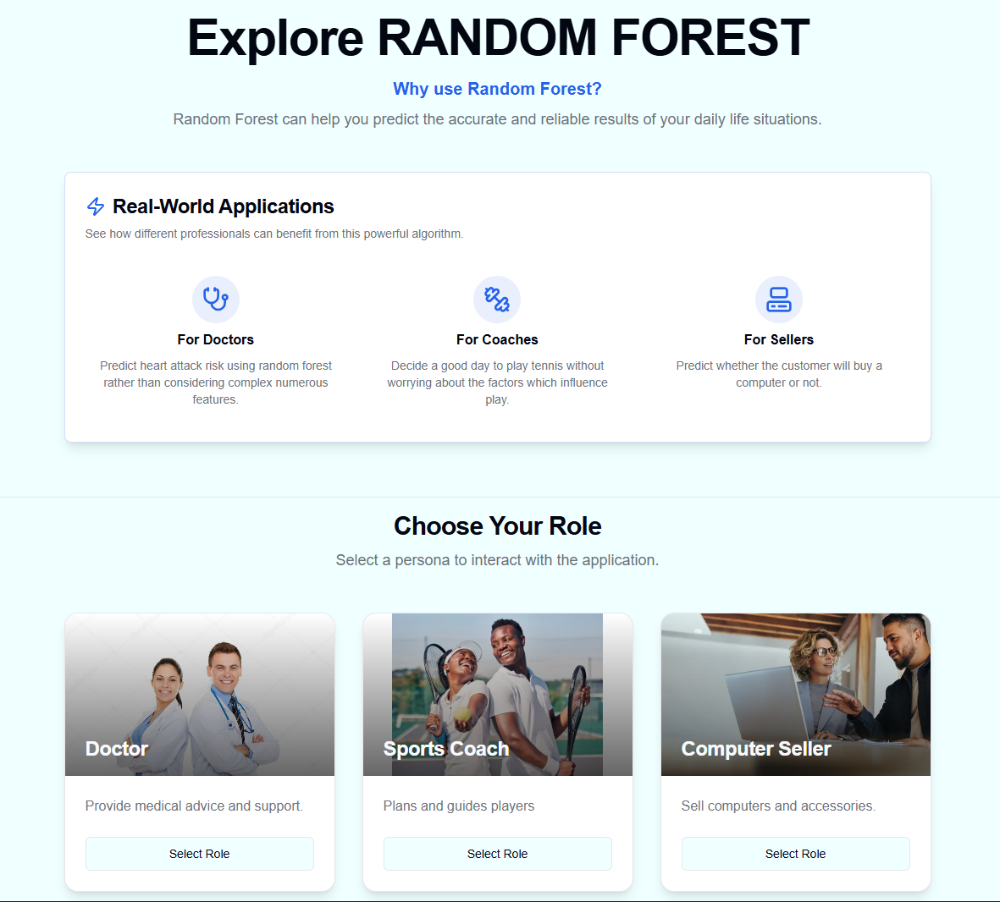

# 🌲 Learn Random Forest Through Visualization  

An interactive and beginner-friendly web app to *learn Random Forest* — one of the most powerful ensemble learning algorithms in Machine Learning — *through visualization*.  

🎯 *Live Demo:*  
👉 *Version 1*[https://forest-explorer-git-main-nitishnaveens-projects.vercel.app?_vercel_share=z8WXMPyTl9AOXNXLvgWkHMjILghhKwkl ](https://forest-explorer-git-main-nitishnaveens-projects.vercel.app?_vercel_share=z8WXMPyTl9AOXNXLvgWkHMjILghhKwkl )
👉 *Version 2*  [forest-insights-git-main-chandan-kumars-projects-dc82feb1.vercel.app ](forest-insights-git-main-chandan-kumars-projects-dc82feb1.vercel.app )

---

## 🖼 Project Preview

<p align="center">
  
</p>


---

## 🧑‍💻 Team Members

| Name | Roll_No | Role |
|------|------|------|
| *Chandan Kumar (24BDS013)*| Worked on version 1 of the project and gave the direction and ignition. Also, shaped the way further for 2nd version and gave inputs over frontend and performed GitHub domain tasks in both the versions. Also, framed the idea to summarise training in view dataset page of all 3 roles in version 2.|

| *Nitish Naveen (24BDS050)*| Built the functional 2nd version of the application using the ideas given by Anchal. Implemented Rithika's idea of tracing the decision tree. Also, debugged the application while working in coordination with Rithika. |

| *Anchal Jaiswal (24BDS003)*| Construction and framing of the idea of the simpler User Interface of version 2 including 3 roles making, story telling and whole "Prediction and explanation" page for all 3 roles. |

| *Rithika S (24BDS067)*| Gave the idea to track how the decision tree works and gives the results for better visualization. Validated the functionality and scanned the bugs in the 2nd version. |

---

## 🧰 Tech Stack

| Technology | Purpose |
|-------------|----------|
| *Next.js* | React-based framework for building fast, interactive web apps |
| *TypeScript* | Type-safe code for better maintainability and reliability |
| *Tailwind CSS* | Utility-first CSS framework for sleek, responsive UI |
| *Recharts / D3.js (optional)* | For creating dynamic visualizations |
| *Vercel* | (Optional) For deployment and hosting |

---

## 🚀 Features

- 🌳 *Visualize Decision Trees and Random Forests*  
- 📈 *Interactive plots* for understanding data splits and predictions  
- 🎨 *Modern responsive UI* built with Tailwind CSS  
- 🧩 *TypeScript-powered components* for clarity and scalability  
- 🧠 Ideal for *students, beginners, and **visual learners*

---

## 🎯 Learning Goals

By exploring this project, you’ll:
- Understand how *Decision Trees* split data  
- Learn how *Random Forest* combines multiple trees for better accuracy  
- Visualize how data points are classified in each tree  
- See *feature importance* and *voting behavior* in action  
- Get a clear, intuitive grasp of how ensemble models work  

---

## 🧩 Project Structure

```bash
Forest-Insights/
│
├── .git/                    # Git version control data
├── .next/                   # Next.js build output
├── public/                  # Static assets (images, icons, etc.)
├── src/                     # Main application source code
│
├── package.json             # Project dependencies and scripts
├── tailwind.config.ts       # Tailwind CSS configuration
├── tsconfig.json            # TypeScript configuration
└── README.md                # Project documentation

⚙ Installation & Setup

Clone the repository

git clone https://github.com/NITISHNAVEEN/FOREST-EXPLORER.git
cd FOREST-EXPLORER


Install dependencies

npm install


Run the development server

npm run dev


Open your browser and visit:
👉 http://localhost:9002

🌐 Live Deployment

You can view the live deployed app here:
🔗 https://forest-explorer-git-main-nitishnaveens-projects.vercel.app?_vercel_share=z8WXMPyTl9AOXNXLvgWkHMjILghhKwkl 

💡 Author

Team FOREST-EXPLORER
Built with ❤ using Next.js, TypeScript, and Tailwind CSS.

🏆 Optional Badges (Add these at the top if you like)
[](https://forest-explorer-git-main-nitishnaveens-projects.vercel.app?_vercel_share=z8WXMPyTl9AOXNXLvgWkHMjILghhKwkl )
[](https://github.com/NITISHNAVEEN/FOREST-EXPLORER/stargazers)
[](https://github.com/NITISHNAVEEN/FOREST-EXPLORER/network/members)
